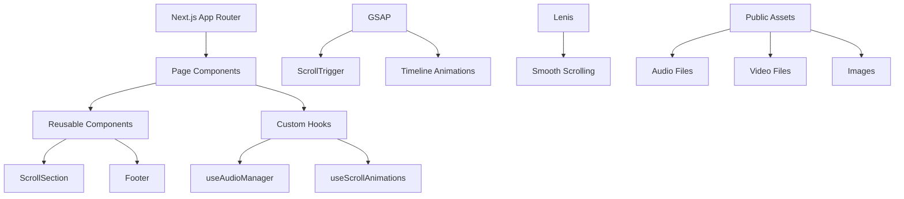

# 🚀 Space Industries

> A modern, interactive web experience showcasing space exploration with cutting-edge animations and immersive audio

<div align="center">
  
  <!-- PROJECT BANNER PLACEHOLDER -->
  
  

  
  <!-- BADGES -->
  
  
  
  
  
  <!-- DEPLOYMENT STATUS -->
  [](https://space-industries-26gn2s5qd-eryck-assis-projects.vercel.app)
  
</div>

---

## 📑 Table of Contents

| Section                                     | Description                                |
| ------------------------------------------- | ------------------------------------------ |
| [🌟 Overview](#-overview)                   | Project introduction and features          |
| [🏗️ Architecture](#️-architecture)          | Technical architecture and design patterns |
| [🛠️ Tech Stack](#️-tech-stack)              | Technologies and tools used                |
| [🚀 Getting Started](#-getting-started)     | Installation and setup                     |
| [📁 Project Structure](#-project-structure) | Directory organization                     |
| [🎭 Features](#-features)                   | Key functionalities                        |
| [🎨 Design Patterns](#-design-patterns)     | Architecture principles                    |
| [🧪 Testing](#-testing)                     | Quality assurance                          |
| [📋 Scripts](#-scripts)                     | Available commands                         |
| [🌐 Deployment](#-deployment)               | Production deployment                      |
| [🤝 Contributing](#-contributing)           | How to contribute                          |

---

## 🌟 Overview

Space Industries is a **premium web experience** that combines modern web technologies with stunning visual animations and immersive audio to create an engaging space exploration journey. Built with **Next.js 16** and **React 19**, this project demonstrates advanced front-end development techniques including:

- 🎬 **GSAP ScrollTrigger Animations**
- 🎵 **Dynamic Audio Management**
- 🎥 **Video Integration**
- 📱 **Responsive Design**
- ⚡ **Performance Optimization**

---

## 🏗️ Architecture



### Design Principles

| Principle                  | Implementation                                     |
| -------------------------- | -------------------------------------------------- |
| **Separation of Concerns** | Hooks for business logic, components for UI        |
| **Component Composition**  | Reusable ScrollSection with flexible props         |
| **Performance First**      | Lazy loading, optimized assets, minimal re-renders |
| **Type Safety**            | Full TypeScript coverage with strict mode          |
| **Accessibility**          | Semantic HTML, keyboard navigation, screen readers |

---

## 🛠️ Tech Stack

### **Core Framework**

| Technology                               | Version | Purpose                         |
| ---------------------------------------- | ------- | ------------------------------- |
| [Next.js](https://nextjs.org)            | 16.0.1  | React framework with App Router |
| [React](https://reactjs.org)             | 19.2.0  | UI library with latest features |
| [TypeScript](https://typescriptlang.org) | 5.9.3   | Type-safe JavaScript            |

### **Animation & Interaction**

| Technology                                | Version | Purpose                     |
| ----------------------------------------- | ------- | --------------------------- |
| [GSAP](https://greensock.com/gsap/)       | 3.13.0  | High-performance animations |
| [Lenis](https://lenis.studiofreight.com/) | 1.3.14  | Smooth scrolling experience |

### **Development Tools**

| Category          | Tools                        |
| ----------------- | ---------------------------- |
| **Linting**       | ESLint 9, Prettier 3.6.2     |
| **Testing**       | Jest 30.2.0, Testing Library |
| **Git Hooks**     | Husky 9.1.7, Commitlint      |
| **Type Checking** | TypeScript 5.9.3             |

### **Quality Assurance**

| Tool           | Configuration              | Purpose          |
| -------------- | -------------------------- | ---------------- |
| **ESLint**     | Next.js + TypeScript rules | Code quality     |
| **Prettier**   | Consistent formatting      | Code style       |
| **Jest**       | JSDOM environment          | Unit testing     |
| **Husky**      | Pre-commit hooks           | Git workflow     |
| **Commitlint** | Conventional commits       | Commit standards |

---

## 🚀 Getting Started

### Prerequisites

```bash
Node.js >= 18.0.0
npm >= 9.0.0
```

### Installation

```bash
# Clone the repository
git clone <repository-url>
cd space-industries

# Install dependencies
npm install

# Start development server
npm run dev
```

### Environment Setup

```bash
# Development
npm run dev          # Start dev server at http://localhost:3000

# Production
npm run build        # Build for production
npm run start        # Start production server
```

---

## 📁 Project Structure

```
space-industries/
├── 📁 app/                    # Next.js App Router
│   ├── 📄 globals.css         # Global styles
│   ├── 📄 layout.tsx          # Root layout
│   └── 📄 page.tsx            # Main page component
├── 📁 components/             # Reusable UI components
│   ├── 📁 sections/           # Page sections
│   │   └── 📄 ScrollSection.tsx
│   └── 📁 ui/                 # UI components
│       └── 📄 Footer.tsx
├── 📁 hooks/                  # Custom React hooks
│   ├── 📄 useAudioManager.ts  # Audio system management
│   └── 📄 useScrollAnimations.ts # GSAP animations
├── 📁 lib/                    # Utility libraries
├── 📁 public/                 # Static assets
│   ├── 📁 audio/              # Audio files
│   ├── 📁 images/             # Image assets
│   └── 📁 videos/             # Video files
├── 📁 .husky/                 # Git hooks
├── 📄 tsconfig.json           # TypeScript config
├── 📄 next.config.mjs         # Next.js config
├── 📄 package.json            # Dependencies
└── 📄 README.md               # Documentation
```

---

## 🎭 Features

### **Visual Experience**

| Feature                  | Technology         | Description                       |
| ------------------------ | ------------------ | --------------------------------- |
| **Scroll Animations**    | GSAP ScrollTrigger | Parallax effects, element reveals |
| **Geometric Animations** | GSAP Timeline      | SVG path animations               |
| **Text Reveals**         | GSAP SplitText     | Character-by-character animations |
| **Video Integration**    | HTML5 Video        | Autoplay background videos        |

### **Audio System**

| Component             | Files         | Purpose                       |
| --------------------- | ------------- | ----------------------------- |
| **Background Music**  | space-bg.mp3  | Ambient space soundtrack      |
| **UI Sounds**         | Various       | Button hovers, scroll effects |
| **Interactive Audio** | 7 total files | Immersive audio experience    |

### **Performance**

| Optimization           | Implementation                  |
| ---------------------- | ------------------------------- |
| **Image Optimization** | Next.js Image component         |
| **Code Splitting**     | Automatic by Next.js            |
| **Bundle Analysis**    | Built-in webpack analyzer       |
| **Lazy Loading**       | React.lazy for heavy components |

---

## 🎨 Design Patterns

### **Architectural Patterns**

#### **Custom Hooks Pattern**

```typescript
// Separation of business logic from UI
const useAudioManager = () => {
  // Audio state and methods
  return { playSound, pauseSound, isPlaying };
};
```

#### **Component Composition**

```typescript
// Flexible, reusable components
<ScrollSection
  backgroundVideo="/videos/space.mp4"
  backgroundColor="black"
  opacity={0.7}
/>
```

#### **Factory Pattern**

```typescript
// Audio element creation
const createAudioElement = (src: string) => {
  const audio = new Audio(src);
  audio.preload = "auto";
  return audio;
};
```

### **State Management**

| Pattern          | Usage                 | Benefit                  |
| ---------------- | --------------------- | ------------------------ |
| **useState**     | Component-level state | Simple, localized state  |
| **useCallback**  | Event handlers        | Performance optimization |
| **useEffect**    | Side effects          | Lifecycle management     |
| **Custom Hooks** | Shared logic          | Reusability              |

---

## 🧪 Testing

### **Testing Strategy**

| Type                  | Framework              | Coverage          |
| --------------------- | ---------------------- | ----------------- |
| **Unit Tests**        | Jest + Testing Library | Components, hooks |
| **Integration Tests** | Testing Library        | User interactions |
| **Type Checking**     | TypeScript             | Static analysis   |

### **Running Tests**

```bash
# Run all tests
npm test

# Watch mode
npm run test:watch

# Coverage report
npm run test:coverage
```

---

## 📋 Scripts

| Script          | Command          | Description               |
| --------------- | ---------------- | ------------------------- |
| **Development** | `npm run dev`    | Start development server  |
| **Build**       | `npm run build`  | Build for production      |
| **Start**       | `npm run start`  | Start production server   |
| **Lint**        | `npm run lint`   | Check code quality        |
| **Format**      | `npm run format` | Format code with Prettier |
| **Test**        | `npm test`       | Run test suite            |

---

## 🌐 Deployment

### **Vercel Deployment**

```bash
# Deploy to Vercel
npx vercel

# Production deployment
npx vercel --prod
```

### **Live Demo**

🔗 **[https://space-industries-26gn2s5qd-eryck-assis-projects.vercel.app](https://space-industries-26gn2s5qd-eryck-assis-projects.vercel.app)**

### **Deployment Configuration**

```json
{
  "buildCommand": "npm run build",
  "outputDirectory": ".next",
  "framework": "nextjs",
  "nodejs": "18.x"
}
```

---

## 🤝 Contributing

### **Development Workflow**

1. **Fork** the repository
2. **Create** a feature branch
3. **Commit** using conventional commits
4. **Test** your changes
5. **Submit** a pull request

### **Commit Standards**

```bash
feat: add new animation effect
fix: resolve audio loading issue
docs: update README documentation
style: improve code formatting
test: add component unit tests
```

### **Code Quality**

- ✅ **ESLint** passes
- ✅ **Prettier** formatted
- ✅ **TypeScript** compiles
- ✅ **Tests** pass
- ✅ **Conventional** commits

---

<div align="center">

### **Built with ❤️ using modern web technologies**


</div>
